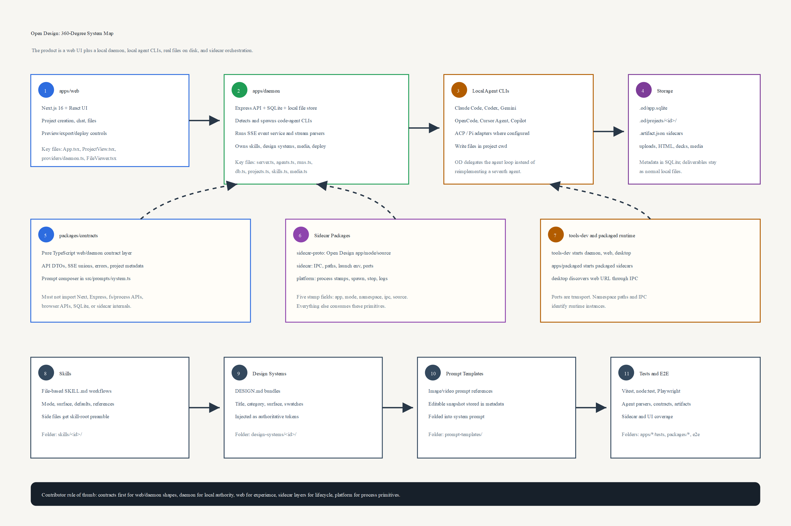
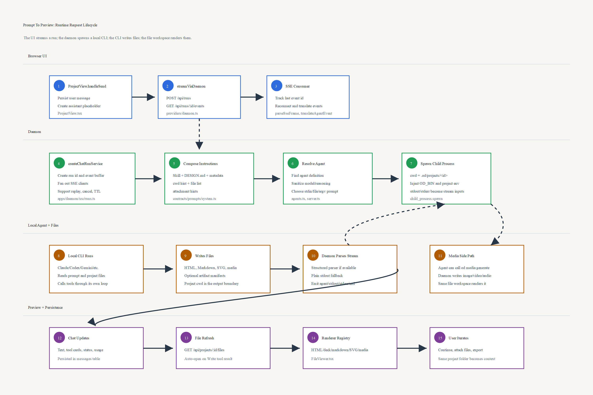
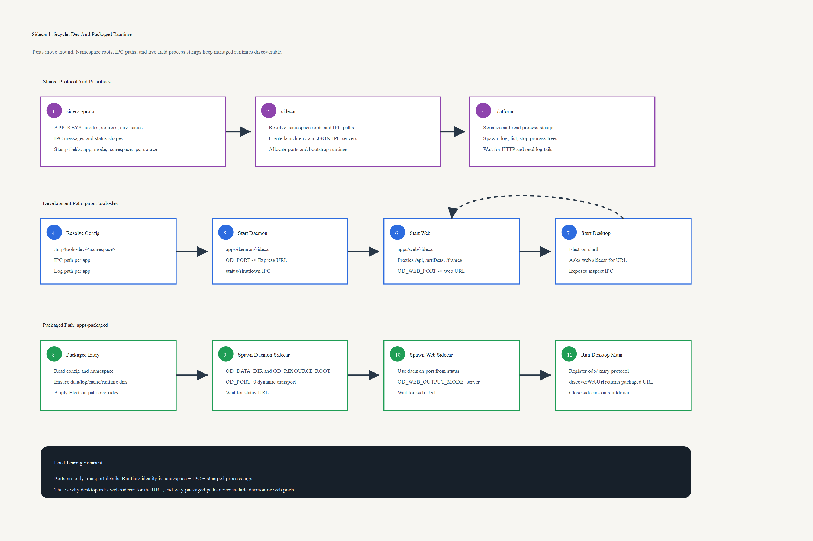

# Open Design 360-Degree Onboarding

This folder is a code-grounded onboarding pack for this Open Design snapshot. It is meant to demystify the product from every useful angle: what the user sees, what the daemon owns, how prompts are assembled, how local coding agents are launched, how files become previewable artifacts, how sidecars coordinate dev and packaged runtimes, and where contributors should make changes.

## Reading Path

1. Start with [01-product-and-repo-map.md](01-product-and-repo-map.md) to understand the product, monorepo boundaries, and the current code/doc truth.
2. Read [02-runtime-request-lifecycle.md](02-runtime-request-lifecycle.md) for the full prompt-to-file execution path.
3. Read [03-agent-skill-prompt-pipeline.md](03-agent-skill-prompt-pipeline.md) for the prompt stack, skill registry, agent adapters, and media contract.
4. Read [04-sidecar-dev-packaged-lifecycle.md](04-sidecar-dev-packaged-lifecycle.md) for `tools-dev`, desktop discovery, IPC, namespace stamps, and packaged runtime.
5. Read [05-data-storage-artifacts-preview.md](05-data-storage-artifacts-preview.md) for SQLite, project folders, file manifests, viewers, export/deploy, and runtime data.
6. Read [06-contributor-playbook.md](06-contributor-playbook.md) before changing the code.

## Infographics

- [infographics/01-system-map.svg](infographics/01-system-map.svg) maps the major applications and packages.
- [infographics/02-request-lifecycle.svg](infographics/02-request-lifecycle.svg) follows a user prompt from the web UI through daemon, agent, SSE, persistence, and preview.
- [infographics/03-sidecar-lifecycle.svg](infographics/03-sidecar-lifecycle.svg) explains `tools-dev`, packaged sidecars, process stamps, runtime roots, and desktop discovery.

PNG renders are generated beside the SVG files when ImageMagick is available.

## Speaker Notes

- [speaker_notes/01-system-map-speaker-notes.md](speaker_notes/01-system-map-speaker-notes.md)
- [speaker_notes/02-request-lifecycle-speaker-notes.md](speaker_notes/02-request-lifecycle-speaker-notes.md)
- [speaker_notes/03-sidecar-lifecycle-speaker-notes.md](speaker_notes/03-sidecar-lifecycle-speaker-notes.md)

The notes follow the numbered visual sequence in each infographic, so a speaker can walk the audience through the picture without needing to improvise the control flow.

## Source Grounding

The highest-signal files behind this onboarding pack are:

- `AGENTS.md`, `apps/AGENTS.md`, `packages/AGENTS.md`, `tools/AGENTS.md`
- `package.json`, `pnpm-workspace.yaml`, `QUICKSTART.md`
- `apps/web/src/App.tsx`, `apps/web/src/components/ProjectView.tsx`, `apps/web/src/providers/daemon.ts`, `apps/web/src/components/FileViewer.tsx`
- `apps/daemon/src/server.ts`, `apps/daemon/src/agents.ts`, `apps/daemon/src/runs.ts`, `apps/daemon/src/db.ts`, `apps/daemon/src/projects.ts`, `apps/daemon/src/skills.ts`, `apps/daemon/src/media.ts`
- `packages/contracts/src/prompts/system.ts`, `packages/contracts/src/api/*`, `packages/contracts/src/sse/*`
- `packages/sidecar-proto/src/index.ts`, `packages/sidecar/src/index.ts`, `packages/platform/src/index.ts`
- `tools/dev/src/index.ts`, `tools/dev/src/config.ts`, `apps/daemon/sidecar/server.ts`, `apps/web/sidecar/server.ts`, `apps/desktop/src/main/index.ts`, `apps/packaged/src/index.ts`, `apps/packaged/src/sidecars.ts`
